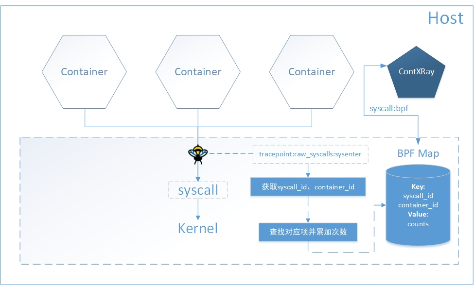
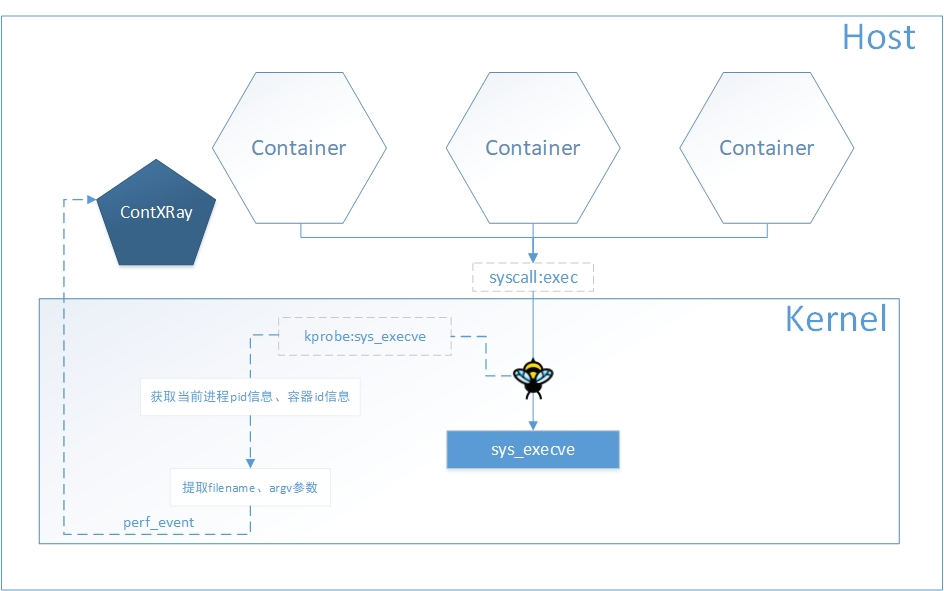
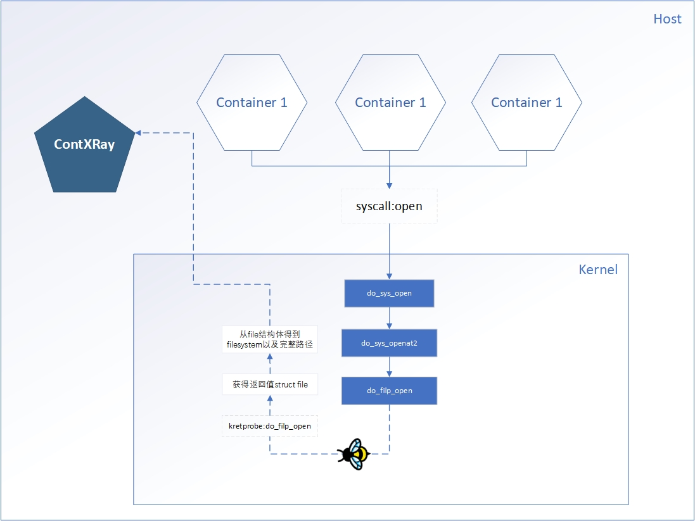
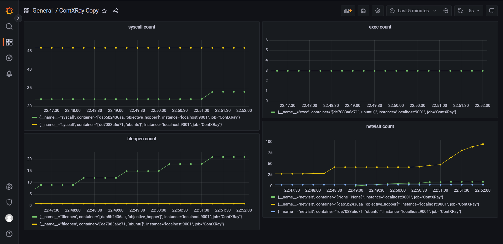

# ContXRay ( Container X-Ray )


- [ContXRay ( Container X-Ray )](#contxray--container-x-ray-)
  - [项目介绍](#项目介绍)
  - [Get Started](#get-started)
  - [目录结构说明](#目录结构说明)
  - [架构设计](#架构设计)
  - [功能模块设计](#功能模块设计)
    - [容器使用的系统调用](#容器使用的系统调用)
    - [容器内执行程序](#容器内执行程序)
    - [容器内文件打开](#容器内文件打开)
    - [容器间互访](#容器间互访)
  - [Promethus/Grafana数据可视化](#Promethus/Grafana数据可视化)
  - [容器异常检测算法](#容器异常检测算法)
  - [参考资料](#参考资料)

---

## 项目介绍

ContXRay是一个基于eBPF技术的容器行为观测工具。

容器技术通过共享主机操作系统的内核，实现轻量的资源虚拟化和隔离，近年来在DevOps、微服务等领域有着广泛的应用。然而在容器技术被广泛接受和使用的同时，容器以及容器运行环境的安全成为了亟待研究和解决的问题，诸如容器逃逸、容器间网络攻击等。

为了帮助解决上述问题，我们基于Linux内核中的eBPF技术，打造了一个可以动态观测容器行为的工具**ContXRay**。通过eBPF技术，ContXRay可以实现对容器的无侵入式的动态观测，包括容器所使用的系统调用、对文件的访问、进程的执行、容器间网络互访等，收集到的信息经过分析后可通过Seccomp等工具对容器进行更细粒度的权限控制，从而最大程度降低攻击平面，保证容器的运行安全。

**本项目正在基于 libbpf 进行重构，以下文档是基于 `bcc_version` 编写的**

## Get Started

- 如果未配置好BCC环境，需要先配置BCC以及所需的内核头文件：

```
sudo apt-get install bpfcc-tools linux-headers-$(uname -r)
```

- bcc版本项目程序目录为`bcc_version`，以下操作均需要在此目录操作

```
cd bcc_version
```

- 安装所需的python依赖模块：

```
sudo apt install python3-pip #如未安装pip3
sudo pip3 install -r ./requirements.txt
```

- 设置ContXRay执行权限

```
sudo chmod +x ./contxray.py
```

- 运行ContXRay

```
sudo ./contxray.py
```

BCC安装具体可参考:[BCC-INSTALL.md](https://github.com/iovisor/bcc/blob/master/INSTALL.md)

- 查看运行结果

    exec、fileopen、netvisit信息会在CLI输出，syscall信息会在相应的日志文件输出。

- 查看运行日志

    日志保存在 `./logs/` 中，以syscall、exec、fileopen、netvisit名称为前缀，时间戳为后缀保存。

    清空日志可使用 `bash ./clearlog.sh`

测试通过的内核版本：

- Kernel 5.13
- Kernel 5.15
- Kernel 5.17

> 在较低版本的内核运行可能存在问题，建议在5.13及以上版本内核运行。

### Promethus/Grafana数据可视化配置

- 安装promethus

```
sudo apt install promethus
```

- 通过docker安装grafana

```
sudo docker pull grafana
sudo docker run -itd -p 3000:3000 grafana
```

- 修改promethus配置文件`/etc/prometheus/prometheus.yml `，在末尾添加以下内容：

```yaml
  - job_name: ContXRay
    static_configs:
      - targets: ['localhost:9001']
```

- 配置Grafana数据源，添加Promethus源，url为http://host_ip:9090
- 导入Grafana Dashboard配置文件`./bcc_version/grafana_panel_json.txt`

- 在启动ContXRay之后，运行`pr_exp.py`

```
cd bcc_version
sudo python3 ./pr_exp.py
```

- 在浏览器中打开`http://host`_ip:3000，进入Dashboard查看

## 目录结构说明

```
.
├── docs                        相关文档
├── LICENSE                     LICENSE
├── README.md                   README
└── bcc_version                         source code
    ├── bpf.c                   eBPF C程序
    ├── clearlog.sh             清除历史日志shell脚本
    ├── contxray.py             ContXRay主程序
    ├── datasave.py             数据保存模块
    ├── gen_seccomp.py          seccomp profile生成工具
    ├── grafana_panel_json.txt  Grafana Dashboard配置文件
    ├── logs                    日志目录
    ├── pr_exp.py               promethus expoter
    └── requirements.txt        python依赖库列表
```

## 架构设计


## 功能模块设计

### 容器使用的系统调用

Docker容器的默认安全配置存在一个较大的攻击平面，Linux内核提供了300多个系统调用，而Seccomp默认会对所有容器禁用44个系统调用。经过测试，大多数容器只需要100多个系统调用，而那些多出来而未被禁用的系统调用，更有可能成为攻击的跳板。

如 `Shocker`可从 Docker 容器逃逸并读取到主机某个目录的文件内容。其攻击的关键是执行了系统调用 `open_by_handle_at`函数，而 Docker1.0 版本对 Capability 使用黑名单管理策略，并且没有限制 `CAP_DAC_READ_SEARCH` 能力，因而引发了容器逃逸的风险。
ContXRay通过 `tracepoint:raw_syscalls`，动态监控容器使用的系统调用，并把这些系统调用的名字、使用的次数记录下来，为后期分析提供数据支撑。

具体实现原理:[get_syscall.md](./docs/get_syscall.md)



> 测试：nginx容器被web访问一次所使用的系统调用 

- JSON形式输出

```json
{
    "['cb955a6f946', 'nginx']": { //容器id 容器名
        "recvfrom": 2, //系统调用名:次数
        "writev": 1,
        "setsockopt": 1,
        "sendfile": 1,
        "fstat": 1,
        "write": 1,
        "stat": 1,
        "epoll_ctl": 1,
        "openat": 1,
        "epoll_wait": 3,
        "accept4": 1,
        "close": 2
    }
}
```

### 容器内执行程序

通常每个容器中运行一组数量有限且明确定义的正常进程，这些进程都是相对稳定和一致的，任何新进程的执行都是存在一定安全风险的。

攻击者可利用应用程序的漏洞、错误配置等进入容器，然后以这个容器为跳板，对内部网络进行探测，进而发现其它容器或者宿主机的进程和文件系统中的弱点来加以进一步利用和攻击。被恶意攻击占领的容器会启动非法进程，如端口扫描进程和反向 Shell 进程等。

ContXRay通过 `kprobe:sys_execve`动态监控容器内进程调用exec执行程序的行为，并获取发起exec的进程pid、command，以及exec中的参数filename、argv等数据，方便后期进行数据分析和异常检测。

具体实现原理:[get_exec.md](./docs/get_exec.md)



> 测试：ubuntu容器内使用cat test.txt

- CLI形式输出

```
exec:::cid-7c6f36ef5c8-ubuntu1,pid:1549540,comm:bash-->filename:/usr/bin/cat,argv:test.txt
```

- JSON形式输出

```json
{
    "['7c6f36ef5c8', 'ubuntu1']": [ //容器id 容器名
        [
            1549540, //执行exec系统调用的进程pid
            "bash", //该进程的command
            "/usr/bin/cat", //exec filename
            "test.txt",//exec argv
            1653726667 //时间戳
        ]
    ]
}
```

### 容器内文件打开

通常，容器内通过Mount Namespace实现了文件系统资源层面的隔离。但由于一些业务的实际需要，需要与宿主机之间共享一部分文件和目录，甚至是 `/proc`、`/dev`等敏感目录。在一般情况下，容器内的程序仅对某些文件或目录进行操作，而当容器被攻击者挟持，成为跳板后，攻击者往往会通过漏洞扫描工具对系统进行扫描，甚至是构造反弹shell的方式进行容器逃逸或者其它攻击行为。

ContXRay通过 `kprobe::do_sys_openat`动态监控容器内文件打开操作。由于在容器内部，open操作是相当频繁的，如果不对数据进行过滤会导致发送大量与正常业务相关的open操作行为数据，所以ContXRay在BPF程序中做了过滤。在一般情况下，容器内部使用的是Overlay文件系统，该文件系统使用层级的结构，大幅度减少了容器占用的存储空间。而Overlay文件系统内部的文件，大多是容器镜像自身所包含的，这些文件的访问不会涉及到安全问题。而对与宿主机共享的文件目录的打开，相对来说是十分敏感的。ContXRay针对这些敏感数据的open行为做了监控，并获取到了执行open的进程的pid、command信息，以及文件名、文件系统等信息。

具体实现原理:[get_fileopen.md](./docs/get_fileopen.md)



> 测试：从ubuntu容器内打开与宿主机共享目录cont_share中的test.txt文件

- CLI形式输出

```
fileopen:::cid:7c6f36ef5c8-ubuntu1,pid:1549540,comm:cat-->fs:ext4,filename:/home/ubuntu/cont_share/test.txt
```

- JSON形式输出

```json
{
    "['7c6f36ef5c8', 'ubuntu1']": [
        [
            1549540, //pid
            "cat", //command
            "/home/ubuntu/cont_share/test.txt", //文件名
            "ext4", //文件系统
            1653726667 //时间戳
        ]
    ]
}
```

### 容器间互访

容器间互访的方式有进程间通信、网络互访等，考虑到容器网络安全层面，ContXRay目前针对容器网络的方式进行容器间访问检测。

在Linux上容器网络的隔离手段是net_namespace,其可以为不同的命名空间从逻辑上提供独立的网络协议栈，具体包括网络设备、路由表、arp表、套接字(socket)等，使得不同的网络空间都像运行在独立的网络中一样：


Netnamespace的网络隔离，使得各容器在逻辑上独占网络协议栈，但实际上还是共享Linux内核网络协议栈进行网络数据的处理，利用各容器都是从同一个宿主机上的网络协议栈处理数据，那么利用eBPF设计容器互访检测大体架构如下：


> 测试：从ubuntu容器使用curl访问nginx容器

- CLI形式输出

```
exec:::cid-cd5a737db6b-ubuntu1,pid:406332,comm:bash-->filename:/usr/bin/curl,argv:172.17.0.3
net:::scid:39841878b98-nginx1(port:80 common:nginx)-->dcid-cd5a737db6b-ubuntu1(port:33428 common:curl)
net:::scid:cd5a737db6b-ubuntu1(port:33428 common:curl)-->dcid-39841878b98-nginx1(port:80 common:nginx)
net:::scid:39841878b98-nginx1(port:80 common:nginx)-->dcid-cd5a737db6b-ubuntu1(port:33428 common:curl)
net:::scid:cd5a737db6b-ubuntu1(port:33428 common:curl)-->dcid-39841878b98-nginx1(port:80 common:nginx)
net:::scid:cd5a737db6b-ubuntu1(port:33428 common:curl)-->dcid-39841878b98-nginx1(port:80 common:nginx)
```

- JSON形式输出

```json


"['39841878b98', 'nginx1']": [ //src container
    [
        80, //source port
        "nginx", // source comm
        "['cd5a737db6b', 'ubuntu1']", //dest container
        33428, //dest port
        "curl" //dest comm
    ],
    [
        80,
        "nginx",
        "['cd5a737db6b', 'ubuntu1']",
        33428,
        "curl"
    ]
    ],
        "['cd5a737db6b', 'ubuntu1']": [
        [
        33428,
        "curl",
        "['39841878b98', 'nginx1']",
        80,
        "nginx"
    ],
    [
        33428,
        "curl",
        "['39841878b98', 'nginx1']",
        80,
        "nginx"
    ],
    [
        33428,
        "curl",
        "['39841878b98', 'nginx1']",
        80,
        "nginx"
    ]
    ]
}

```

## Promethus/Grafana数据可视化



## Seccomp Docker Profile生成

可以根据ContXRay生成的syscall调用信息，生成该容器所需的系统调用白名单列表，从而最大程度降低攻击平面。

可通过`gen_seccomp.py`生成：

```
./gen_seccomp.py container_name file1 file2 ... fileN
```

该工具运行后，会生成一个`container_name_profile.json`文件，可以通过以下方式使用

```
docker run --rm \
             -it \
             --security-opt seccomp=/path/to/seccomp/profile.json \
             hello-world
```

该文件的编写格式以及使用方法具体可参考Docker官方文档：https://docs.docker.com/engine/security/seccomp/

## 容器异常检测算法

受文献[Zhuping Zou](https://ieeexplore.ieee.org/author/37089323827)等人文献《[A Docker Container Anomaly Monitoring System Based on Optimized Isolation Forest](https://ieeexplore.ieee.org/abstract/document/8807263)》(DOI:[10.1109/TCC.2019.2935724](https://doi.org/10.1109/TCC.2019.2935724))启发，可以利用孤立森林算法对容器异常进行检测。但是原始孤立森林算法存在着诸多缺陷，需要对其进行改进，以增加检测性能。

我们通过对数据进行预处理，降低其波动性，并修改原有PathLength算法，可以在一定程度上增加了准确率并降低了误报率。

## 参考资料

1.绿盟科技容器安全技术报告(https://www.nsfocus.com.cn/upload/contents/2018/11/20181109100414_79051.pdf)

2.绿盟云原生安全技术报告(https://www.nsfocus.com.cn/html/2021/101_0705/160.html)

3.eBPF技术介绍(https://www.ebpf.top/post/ebpf_intro/)

4.基于eBPF实现容器运行时安全(https://www.ebpf.top/post/ebpf_container_security/)

5.BCC 到 libbpf 的转换指南(https://www.ebpf.top/post/bcc-to-libbpf-guid/)

6.bcc Reference Guide(https://github.com/iovisor/bcc/blob/master/docs/reference_guide.md)

7.容器Cgroup和Namespace特性简介(https://zhuanlan.zhihu.com/p/80733932)

8.特权模式下Docker逃逸手法总结(https://mp.weixin.qq.com/s/JAJumU78zzZtBkjXffXzyQ)

9.How Docker Works(https://www.youtube.com/watch?v=-YnMr1lj4Z8)

10.邢云龙-基于系统调用限制的容器安全防护方案-武汉大学学报(https://kns.cnki.net/kcms/detail/detail.aspx?dbcode=CJFD&dbname=CJFDLAST2022&filename=WHDY202201005)

11.MiniCon: Automatic Enforcement of a Minimal Capability Set for Security-Enhanced Containers(DOI:10.1109/IEMTRONICS52119.2021.9422529)

12.Docker容器网络通信原理分析(https://bbs.huaweicloud.com/blogs/257891)


